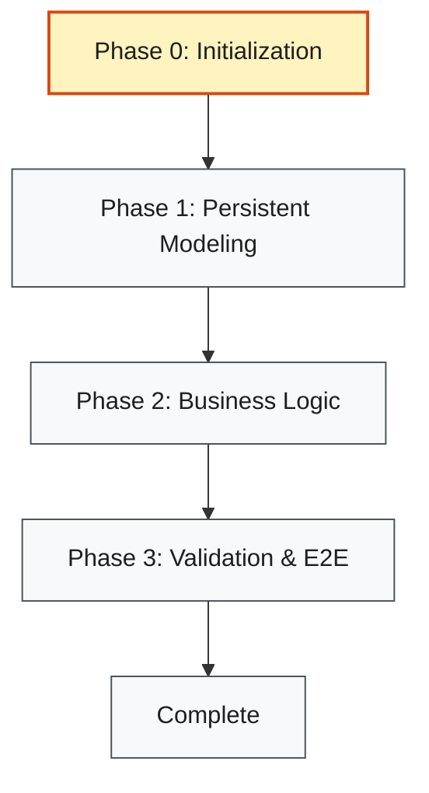

# Feature List & Roadmap Maintenance

## Core Rule

The files `features.md` and `readiness-checklist.md` under `docs/roadmap-discipline/` are the single source of truth for project features, current progress, environment status, and resume notes.

## 1. Startup Readiness Checklist Template

`docs/roadmap-discipline/readiness-checklist.md` must follow this structure:

````markdown
# Startup Readiness Checklist

This checklist confirms the workspace is in an operable state for any fresh agent session.

## Conditions

- [ ] **Condition 1: Can Start**
  - Setup/installation command: `bun install` (or equivalent)
  - Start command: `bun dev` (or equivalent)
  - Verification: environment runs and dependencies are successfully locked.
- [ ] **Condition 2: Can Test**
  - Test command: `bun test` (or equivalent)
  - Verification: test runner is configured and baseline tests pass.
- [ ] **Condition 3: Can See Progress**
  - Feature list: `docs/roadmap-discipline/features.md` exists and is current.
- [ ] **Condition 4: Can Pick Up Next Steps**
  - Next action is clearly identified, and features list shows current state.

## Operational Logs / Details
- Dependency framework: Bun / npm / pip
- Test framework: Vitest / pytest
- Verification details: ...
````

## 2. Feature List Template

`docs/roadmap-discipline/features.md` must follow this structure:

````markdown
# Project Feature Roadmap

**Status:** In Progress
**Current Phase:** Phase 0: Initialization

## Global Phases

- [ ] Phase 0: Initialization (Startup Readiness)
- [ ] Phase 1: Core persistent modeling
- [ ] Phase 2: Business logic and API implementation
- [ ] Phase 3: Final validation and end-to-end testing

## Phase Roadmap



## Features

### Phase 0: Initialization (Startup Readiness)

- [ ] **F0.1** (State: `active` | Verification: `bun install` or equivalent environment check)
  - *Behavior:* Ensure dependencies are successfully installed and the workspace is runnable.
  - *Evidence:* None
- [ ] **F0.2** (State: `not_started` | Verification: run a test command like `bun test` verifying test runner works)
  - *Behavior:* Establish and verify that a test runner/framework is active and passing.
  - *Evidence:* None
- [ ] **F0.3** (State: `not_started` | Verification: inspect `docs/roadmap-discipline/readiness-checklist.md` existence)
  - *Behavior:* Document the startup readiness checklist covering the 4 conditions.
  - *Evidence:* None
- [ ] **F0.4** (State: `not_started` | Verification: inspect `docs/roadmap-discipline/features.md`)
  - *Behavior:* Establish the initial feature list with behavior descriptions, verification commands, and states.
  - *Evidence:* None
- [ ] **F0.5** (State: `not_started` | Verification: run `git status` to ensure clean checkpoint)
  - *Behavior:* Create a clean Git commit checkpoint for the initialization phase.
  - *Evidence:* None

### Phase 1: Core persistent modeling

- [ ] **F1.1** (State: `not_started` | Verification: `<command>`)
  - *Behavior:* `<Description of behavior>`
  - *Evidence:* None
- [ ] **F1.2** [parallel: subagents recommended] (State: `not_started` | Verification: `<command>`)
  - *Behavior:* `<Description of behavior>`
  - *Evidence:* None

## Resume Notes

- **Last completed:** ...
- **Next action:** ...
- **Known blockers:** None / Describe blocker.
````

## Parallel Work Markers

Mark independent same-phase features with `[parallel: subagents recommended]` when they can safely run at the same time with separate write scopes or read-only scopes.

## Mermaid Roadmap Rules

`## Phase Roadmap` is a visual mirror of `## Global Phases`. Update the diagram classes (e.g. `class P1 current;`) to keep it synchronized with the active phase.

## Update Rules

| Area | Agent may edit directly | Rule |
| --- | --- | --- |
| Feature triples (`Fxx`) | Yes | Update states (`not_started` -> `active` -> `passing`), behaviors, verification, and evidence. |
| Parallel markers | Yes | Mark independent same-phase items with `[parallel: subagents recommended]`. |
| Resume notes | Yes | Keep `Last completed`, `Next action`, and `Known blockers` current. |
| Global phase status | Yes | Check a global phase only after every feature item in it is checked (`passing`). |
| Phase roadmap diagram | Yes | Sync the `current` class styling with the active phase. |
| Global phase list | No | Suggest changes to phase scopes and wait for user approval. |

Changing `Status` to `Complete`, `Blocked`, or `Deferred` is a claim about execution state. Make that change only after checkboxes and resume notes support it.
