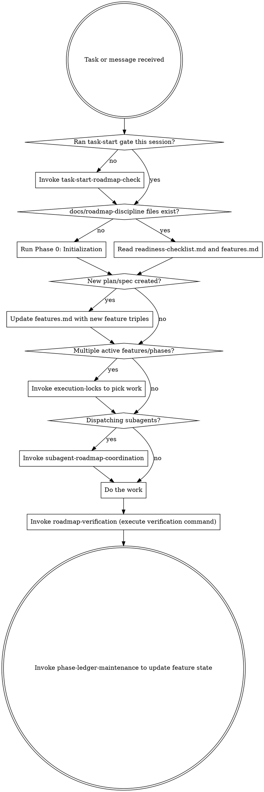

# Using Roadmap Discipline

`.agents/skills/roadmap-discipline/` is a bundle of skills that keep roadmap-driven work ordered, resumable, and anchored to disk state instead of chat memory. This skill is the front door: it tells you which roadmap-discipline skill to invoke and when.

## The Rule

**Invoke the relevant roadmap-discipline skill BEFORE selecting, executing, delegating, or completing work.**

If there is even a 1% chance the workspace is starting or resuming, you MUST run the task-start gate first. Do not choose work from memory, chat summaries, or a task plan. Initialize the workspace first, read the feature list from disk, follow the active lock, and update the feature list before moving on.

## Routing Flow

## Which Skill, When

| Situation | Invoke |
| --- | --- |
| Starting, resuming, continuing, redirecting, or delegating any task | `task-start-roadmap-check` |
| You need the end-to-end flow for ordered phased work | `tracking-phased-work` |
| Creating, updating, or repairing `features.md` or `readiness-checklist.md` | `phase-ledger-maintenance` |
| Deciding which feature or phase to work on when multiple apply | `execution-locks` |
| Spawning or reviewing subagents for roadmap-backed work | `subagent-roadmap-coordination` |
| Before claiming a feature is complete (runs the verification command) | `roadmap-verification` |

When in doubt, start with `task-start-roadmap-check`; it initializes the session.

## Skill Priority

Roadmap-discipline skills run before implementation. Order:

1. `task-start-roadmap-check` — gate before any task work (forces Phase 0: Initialization first).
2. `execution-locks` — when deciding where to focus.
3. `phase-ledger-maintenance` — create or update `features.md` on disk.
4. `subagent-roadmap-coordination` — only after active features are identified.
5. `roadmap-verification` — runs the verification command before updating any status.

## Red Flags

These thoughts mean STOP — you are violating the discipline:

| Thought | Reality |
| --- | --- |
| "This is just a quick fix." | Quick fixes are roadmap work too. Run the task-start gate. |
| "I remember what comes next." | Memory is not the source of truth. Read `features.md` from disk. |
| "I will inspect the code first and check the features after." | The initialization gate comes before inspecting implementation files. |
| "I don't have a plan yet, so I cannot start the roadmap." | Start Phase 0 immediately. Build the readiness checklist and draft the roadmap. Update when the plan is created. |
| "Tests passed, so the feature must be complete." | No completion claim without executing the verification command and logging evidence. |
| "I will update the feature list after a few more steps." | Update the feature list before moving on, not later. |

The fix is always the same: run `task-start-roadmap-check`, follow the active lock, and keep the feature list current.
